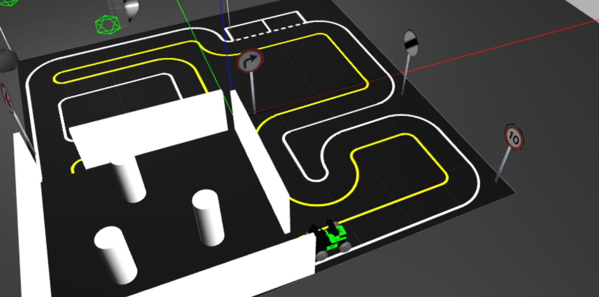
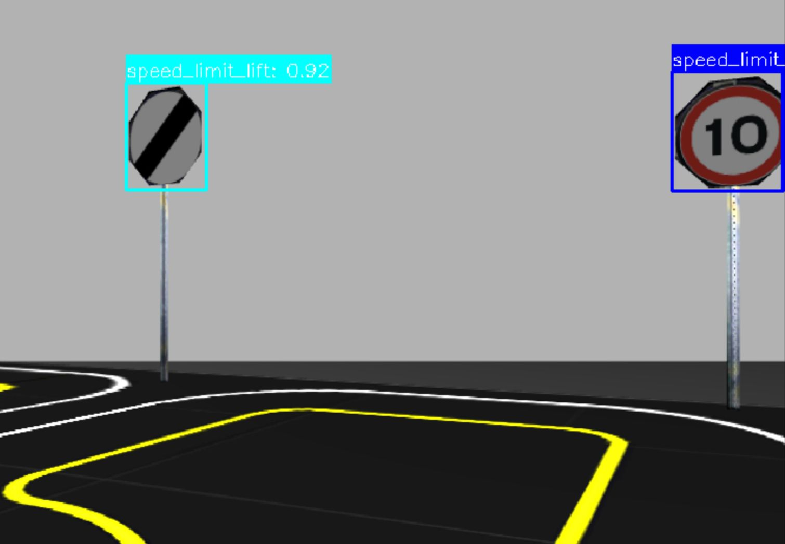
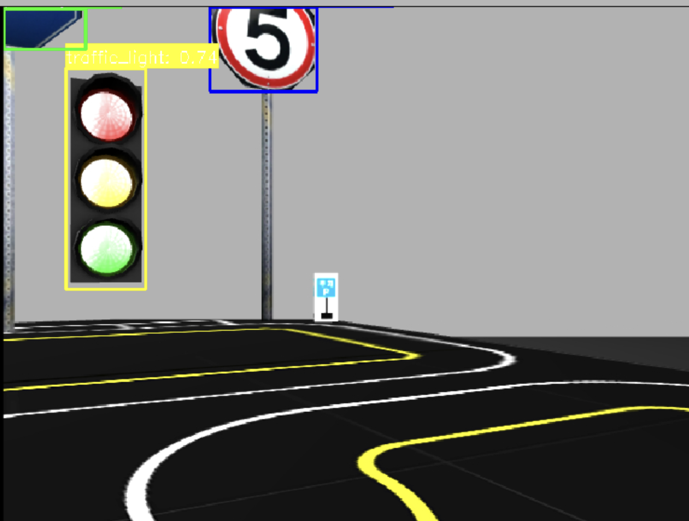
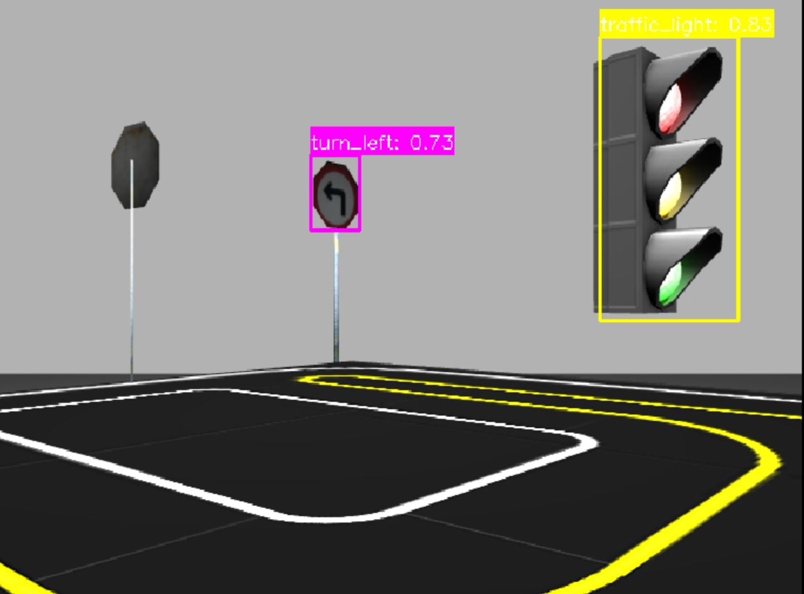
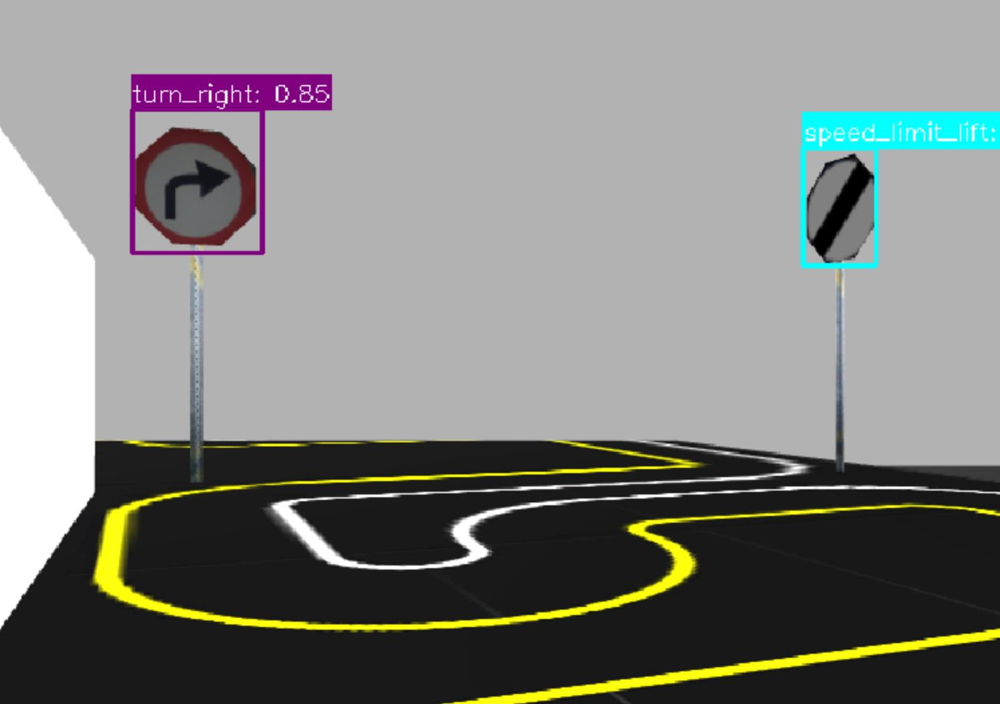
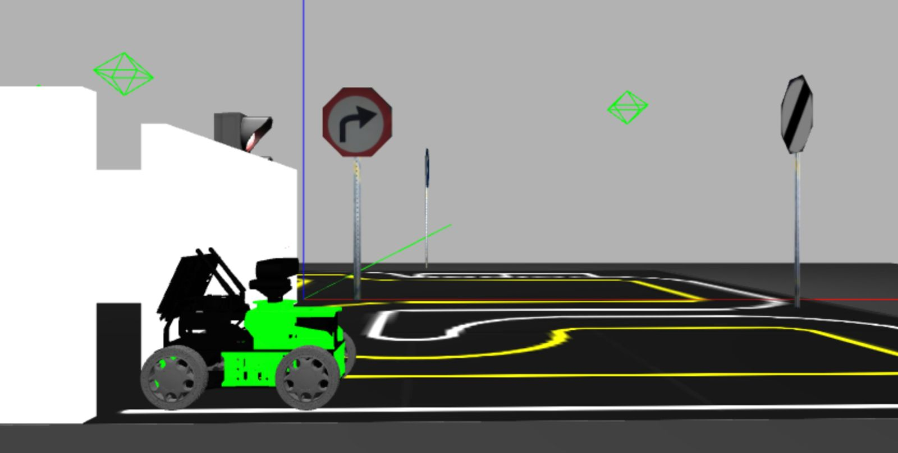

# Robotic Traffic Sign Recognition

A ROS-based system for real-time traffic sign detection using a YOLO neural network running on a simulated HiWonder robot in Gazebo. The robot is teleoperated through a track populated with traffic signs, and the detection node identifies and labels each sign from the on-board camera feed in real time.


*Gazebo simulation environment: the HiWonder robot navigates a track with traffic signs and road markings.*

---

## sign_detection Package

This is the core package. It runs a ROS node (`lab1.py`) that:

1. **Loads a fine-tuned YOLO model** (`weights/best.pt`) trained to recognise eight traffic sign classes:
   - `dead_end`, `no_right`, `parking`, `speed_limit_10`, `speed_limit_lift`, `traffic_light`, `turn_left`, `turn_right`

2. **Subscribes to the robot's camera** topic (`/rgbd_camera/rgb/image_raw`) and runs YOLO inference every N frames (configurable via the `inference_interval` parameter, default 3).

3. **Publishes an annotated image** to `/rgbd_camera/rgb/image_with_boxes` with colour-coded bounding boxes and confidence scores drawn over each detected sign.

The model was trained using the Jupyter notebook in `notebook/training.ipynb`, which fine-tunes YOLOv8/YOLO11 on a custom dataset of simulated traffic sign images located in `dataset/`.

### Detection Results

The following screenshots show the detection node in action inside the simulator:

| | |
|:---:|:---:|
|  |  |
| *Speed limit lift (0.92) and speed limit 10 detected* | *Traffic light and speed limit sign detected* |
|  |  |
| *Turn left (0.73) and traffic light (0.83)* | *Turn right (0.85) and speed limit lift* |

### Launch File

The launch file (`launch/lab1.launch`) starts three nodes in a single command:

```xml
<launch>
  <!-- Detection node: runs YOLO inference on the camera feed -->
  <node pkg="sign_detection" type="lab1.py" name="lab1_node" output="screen">
    <param name="inference_interval" value="3"/>
  </node>

  <!-- Keyboard teleop: remaps velocity commands to the HiWonder robot -->
  <node pkg="teleop_twist_keyboard" type="teleop_twist_keyboard.py" name="teleop_keyboard">
    <remap from="cmd_vel" to="/hiwonder/cmd_vel"/>
  </node>

  <!-- RViz: visualisation of the robot and camera feed -->
  <node pkg="rviz" type="rviz" name="rviz"/>
</launch>
```

- **lab1_node** -- the detection node described above.
- **teleop_keyboard** -- keyboard control for the robot (see below). The `cmd_vel` topic is remapped to `/hiwonder/cmd_vel` so commands reach the simulated robot.
- **rviz** -- opens RViz for visualising the robot state and annotated camera output.

---

## teleop_twist_keyboard Package

A keyboard teleoperation node that reads keypresses and publishes `geometry_msgs/Twist` messages to drive the robot. Key bindings use a layout similar to `vim`/`WASD`:

| Key | Action |
|-----|--------|
| `i` | Forward |
| `,` | Backward |
| `j` | Turn left |
| `l` | Turn right |
| `q`/`z` | Increase / decrease all speeds |
| `k` | Stop |

Speed is adjusted in 10% increments. The node is launched automatically by `lab1.launch` with its output remapped to the HiWonder robot.


*The HiWonder robot next to a turn-right sign in the Gazebo environment.*

---

## Getting Started

### Prerequisites

- [VS Code](https://code.visualstudio.com/) with the **Dev Containers** extension
- [Docker Desktop](https://www.docker.com/products/docker-desktop/)

### Running with VS Code Dev Container

1. **Open the project** in VS Code:

   ```
   File > Open Folder > select the docker-container/ directory
   ```

2. **Reopen in Container** -- VS Code will detect the `.devcontainer/devcontainer.json` configuration and prompt you. Click **"Reopen in Container"** (or run the command `Dev Containers: Reopen in Container` from the command palette). This builds and starts the Docker services (X server, Gazebo simulator, and ROS workspace).

3. **Build the workspace** inside the container terminal:

   ```bash
   catkin build
   ```

4. **Source the workspace**:

   ```bash
   source devel/setup.bash
   ```

5. **Launch the system**:

   ```bash
   roslaunch sign_detection lab1.launch
   ```

   This starts the detection node, keyboard teleop, and RViz. Use the keyboard bindings listed above to drive the robot through the track while the YOLO model detects traffic signs in real time.

6. **View the simulator GUI** by opening `http://localhost:3000` in your browser (the X server renders Gazebo and RViz).

---

## Project Structure

```
docker-container/
├── .devcontainer/          # VS Code Dev Container configuration
│   ├── devcontainer.json
│   ├── Dockerfile
│   └── docker-compose.yml
├── docker-compose.yml      # Multi-service orchestration (xserver, simulator, workspace)
├── src/
│   ├── sign_detection/     # Main detection package
│   │   ├── src/lab1.py           # YOLO detection ROS node
│   │   ├── launch/lab1.launch    # Launch file (detection + teleop + rviz)
│   │   ├── weights/best.pt       # Trained YOLO model
│   │   ├── dataset/              # Training data and data.yaml
│   │   └── notebook/             # Jupyter notebook for model training
│   └── teleop_twist_keyboard/    # Keyboard teleoperation package
│       ├── scripts/teleop_twist_keyboard.py
│       └── launch/teleop.launch
└── ros/                    # Gazebo models and world files
```

---

## Acknowledgements

This project was prepared based on various online resources, including the Docker image and simulation environment originally developed by Dr Sen Wang
